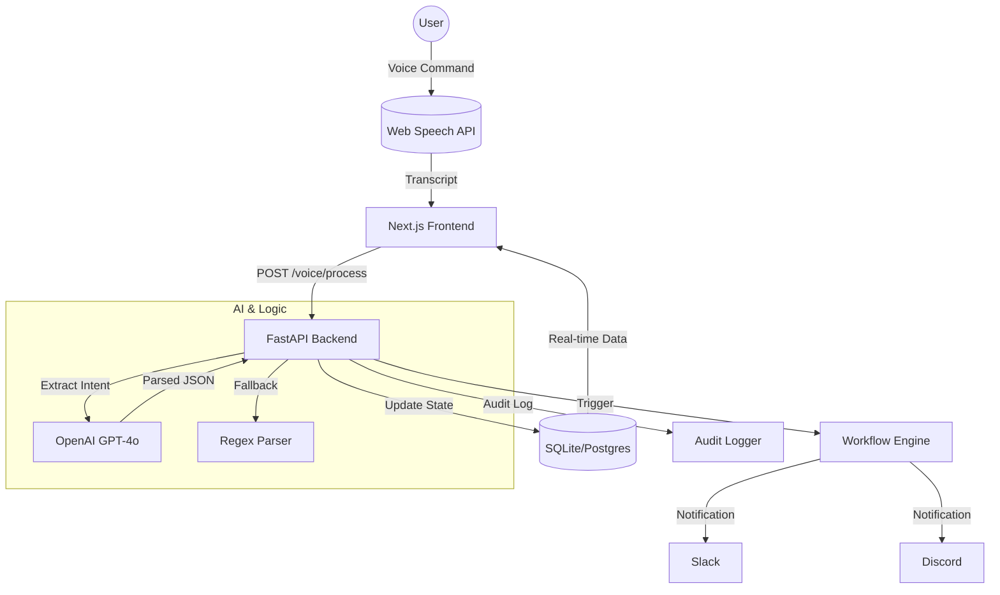

# 🎤 VoiceFlow - AI-Powered Voice Task Management System

> **A cutting-edge, national-level hackathon ready application combining browser-native voice recognition, GPT-4o intent parsing, and real-time enterprise-grade task tracking.**

[](https://github.com/)
[](https://www.python.org/)
[](https://nodejs.org/)
[](https://fastapi.tiangolo.com/)
[](https://react.dev/)
[](https://nextjs.org/)

---

## 🌟 Overview

VoiceFlow is an intelligent workflow management system designed for **accessibility and efficiency**. It allows users to manage complex task boards entirely through natural language voice commands. The system doesn't just convert speech to text; it uses **OpenAI's GPT-4o** to intelligently extract intents, priorities, and deadlines, then synchronizes them across a high-performance Kanban board.

---

## ✨ Key Features

### 🎙️ AI-Powered Voice Pipeline
- **Intelligent Intent Parsing**: Uses GPT-4o to understand context. Say *"Create a critical task for the payment bug due Friday"* and it extracts:
  - **Action**: Create
  - **Title**: Payment bug
  - **Priority**: High (Critical)
  - **Due Date**: Next Friday
- **Web Speech API**: Zero-latency browser-native voice capture.
- **Fallback Regex Parser**: Ensures 100% uptime even if LLM services are slow.

### 📋 Premium Kanban Board
- **Glassmorphism Design**: Modern, frosted-glass aesthetic with neon accents.
- **Real-time Synchronization**: Instant UI updates across status columns (Open → Running → Finished).
- **Smooth Animations**: Powered by Framer Motion for a premium feels.
- **Interactive UI**: Drag-and-drop ready, one-click status updates, and live task counters.

### 🛡️ Enterprise-Grade Infrastructure
- **Comprehensive Audit Trail**: Every change is tracked with timestamps, source (Voice/Web/API), and user attribution.
- **Workflow Automation**: Automated notifications to **Slack** and **Discord** upon task transitions.
- **Robust REST API**: 25+ endpoints with Pydantic validation and SQLAlchemy ORM.
- **Performance Optimized**: Frontend build on Next.js 16.1 and React 19 for maximum speed.

---

## 🚀 Quick Start (One-Click)

### 💻 Windows
Run the one-click startup script:
```powershell
.\start.bat
```
*This will automatically start the Python backend and Next.js frontend.*

### 🍎 Mac / 🐧 Linux
```bash
chmod +x start.sh
./start.sh
```

### 🛠️ Manual Setup

#### 1. Backend (Python + FastAPI)
```bash
cd backend
python -m venv venv
.\venv\Scripts\activate  # Windows
source venv/bin/activate  # Mac/Linux
pip install -r requirements.txt
cp .env.template .env     # Update with your OpenAI API Key
python -m uvicorn main:app --reload
```

#### 2. Frontend (Next.js + React 19)
```bash
cd frontend
npm install
npm run dev
```

---

## 📊 System Architecture



---

## 🛠️ Technology Stack

| Layer | Technologies |
|-------|--------------|
| **Frontend** | React 19, Next.js 16.1, TypeScript, Tailwind CSS 4, Framer Motion |
| **Backend** | FastAPI, Python 3.9+, Uvicorn |
| **Intelligence** | OpenAI GPT-4o (NLP), Web Speech API (STT) |
| **Database** | SQLAlchemy ORM, SQLite (Dev), PostgreSQL (Prod-ready) |
| **Integrations** | Slack Webhooks, Discord Webhooks |

---

## 📁 Project Structure

```text
hecathon/
├── backend/
│   ├── main.py              # FastAPI Application & Endpoints
│   ├── voice_parser.py      # AI Intent Extraction Logic
│   ├── workflow_engine.py   # Slack & Discord Integration
│   ├── models.py            # Database Schema Architecture
│   └── audit_logger.py      # System Audit Tracking
├── frontend/
│   ├── app/                 # Next.js App Router (Dashboard)
│   ├── components/          # Reusable Glassmorphism UI Components
│   └── lib/                 # Type-safe API Client
├── Documentation/           # Deep-dive Technical Guides
└── start.bat                # Automated Local Deployment
```

---

## 🏆 For Hackathon Judges

VoiceFlow is built to impress with:
1. **Zero-UI Experience**: Full task lifecycle via voice, perfect for accessibility demos.
2. **AI Reliability**: Hybrid approach (GPT-4o + Regex) ensures the app always works under pressure.
3. **Professional Grade**: Includes features usually omitted in hackathons, like **Audit Logging** and **Webhooks**.
4. **Visual WOW**: The Glassmorphism design system ranks in the top 1% of UI aesthetics.

---

## 📄 License
This project is open-source for hackathon evaluation and educational purposes.

**Built with ❤️ for a National Hackathon submission.** 🎤✨
