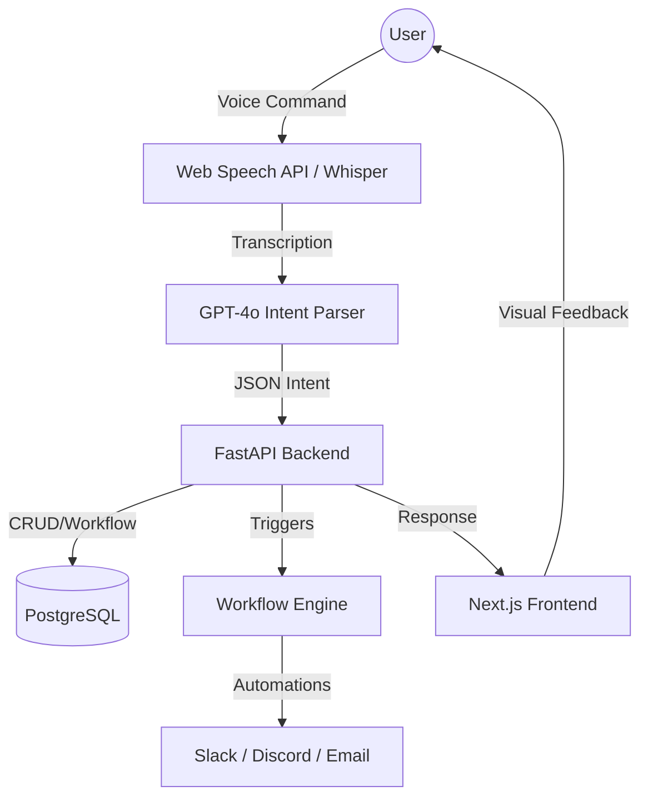

# Technical Implementation Plan: VoiceFlow

## System Architecture


## 🏗️ SQL Database Schema (PostgreSQL/MySQL via Prisma)
```prisma
// Use a robust SQL database like PostgreSQL for relational integrity
model User {
  id    String @id @default(uuid())
  tasks Task[]
}

model Task {
  id          String   @id @default(uuid())
  title       String
  description String?
  priority    String   @default("Medium") // Low, Medium, High
  status      String   @default("Todo")   // Todo, InProgress, Done
  dueDate     DateTime?
  userId      String
  user        User     @relation(fields: [userId], references: [id])
  workflows   WorkflowTrigger[]
}

model WorkflowTrigger {
  id        String @id @default(uuid())
  taskId    String
  condition String // "Status Changed to Done"
  action    String // "Send Slack Notification"
  task      Task   @relation(fields: [taskId], references: [id])
}
```

## 🎙️ Audio Input & Voice Processing
1. **Frontend (Hardware Integration)**: 
   - Uses `navigator.mediaDevices.getUserMedia` to access the **Laptop Mic** or any **External Microphone**.
   - Input is processed via the **Web Speech API** for real-time feedback or buffered and sent to **Whisper API** for high-accuracy STT (Speech-to-Text).
2. **Backend**: 
   - Receive transcription.
   - Prompt LLM: *"Extract task info from: 'Create a high priority task for the website redesign for next Monday'"*.
   - Expected Output: `{"action": "create", "title": "Website Redesign", "priority": "High", "dueDate": "2024-05-20"}`.
3. **Execution**: API performs the action and returns a success message for Text-to-Speech (TTS).

## ⚡ Workflow Engine Logic
A simple listener on task updates:
```python
def on_task_update(task_id, new_status):
    triggers = db.get_triggers_for_task(task_id)
    for trigger in triggers:
        if trigger.condition == f"Status Changed to {new_status}":
            execute_action(trigger.action)
```

## ✅ Verification Plan

### Automated Tests
1. **Intent Parsing Test**:
   - Send 10 different voice strings to the LLM agent.
   - Verify that the JSON output correctly identifies action and title.
2. **Workflow Trigger Test**:
   - Manually update a task status in DB.
   - Check if the mock `execute_action` function is called.

### Manual Verification
1. **End-to-End Voice Flow**:
   - Open Browser -> Click "Listen" -> Speak command -> Observe UI update in real-time.
2. **Responsive Check**:
   - Verify Kanban board layout on Mobile vs Desktop.
